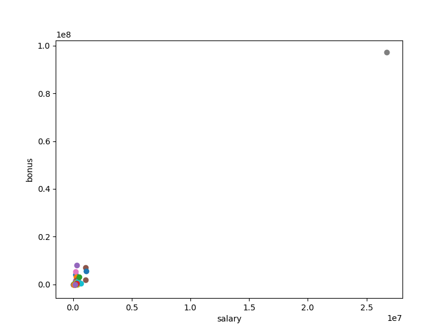
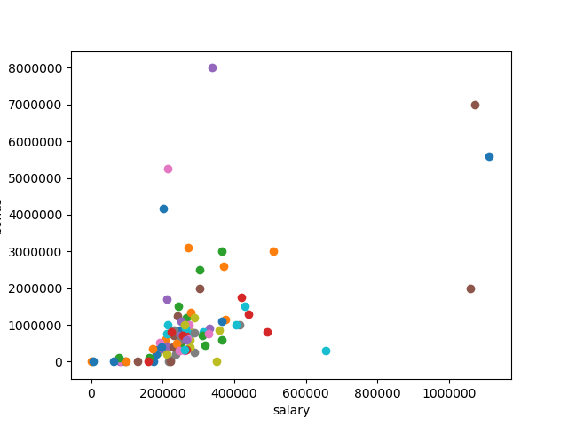

# Identify Fraud From Enron Email

## Overview
In 2000, Enron was one of the largest companies in the United States. By 2002, it had collapsed into bankruptcy due to widespread corporate fraud. In the resulting Federal investigation, a significant amount of typically confidential information entered into the public record, including tens of thousands of emails and detailed financial data for top executives. In this project, you will play detective, and put your new skills to use by building a person of interest identifier based on financial and email data made public as a result of the Enron scandal. To assist you in your detective work, we've combined this data with a hand-generated list of persons of interest in the fraud case, which means individuals who were indicted, reached a settlement or plea deal with the government, or testified in exchange for prosecution immunity.

As preprocessing to this project, we've combined the Enron email and financial data into a dictionary, where each key-value pair in the dictionary corresponds to one person. The dictionary key is the person's name, and the value is another dictionary, which contains the names of all the features and their values for that person. The features in the data fall into three major types, namely financial features, email features and POI labels.

**financial features:** ['salary', 'deferral_payments', 'total_payments', 'loan_advances', 'bonus', 'restricted_stock_deferred', 'deferred_income', 'total_stock_value', 'expenses', 'exercised_stock_options', 'other', 'long_term_incentive', 'restricted_stock', 'director_fees'] (all units are in US dollars)

**email features:** ['to_messages', 'email_address', 'from_poi_to_this_person', 'from_messages', 'from_this_person_to_poi', 'shared_receipt_with_poi'] (units are generally number of emails messages; notable exception is ‘email_address’, which is a text string)

**POI label:** [‘poi’] (boolean, represented as integer)


## Understanding the Dataset and Question

>1. Summarize for us the goal of this project and how machine learning is useful in trying to accomplish it. As part of your answer, give some background on the dataset and how it can be used to answer the project question. Were there any outliers in the data when you got it, and how did you handle those?  [relevant rubric items: “data exploration”, “outlier investigation”]

### Data Exploration
The goal of this project was to use the end-to-end process of investigating the data through a machine learning lens to identify Persons of Interest with the Enron Data. Machine learning is useful to accomplish this task because of it's ability to be trained and predict a value to a degree of accuracy.

This dataset includes 146 data points with 22 features. There are 18 people identified as POI and 127 as non-POI.

I decided to use 10 features plus the POI label when processing the data:
>'poi', 'exercised_stock_options', 'total_stock_value', 'bonus', 'salary', 'fraction_to_poi', 'deferred_income', 'long_term_incentive', 'restricted_stock', 'total_payments', 'shared_receipt_with_poi'

There was definitely missing/incomplete data. All of the features had at least 1 NaN value besides the poi feature:
- 'bonus': 64,
- 'deferral_payments': 107,
- 'deferred_income': 97,
- 'director_fees': 129,
- 'email_address': 35,
- 'exercised_stock_options': 44,
- 'expenses': 51,
- 'from_messages': 60,
- 'from_poi_to_this_person': 60,
- 'from_this_person_to_poi': 60,
- 'loan_advances': 142,
- 'long_term_incentive': 80,
- 'other': 53,
- 'poi': 0,
- 'restricted_stock': 36,
- 'restricted_stock_deferred': 128,
- 'salary': 51,
- 'shared_receipt_with_poi': 60,
- 'to_messages': 60,
- 'total_payments': 21,
- 'total_stock_value': 20

### Outlier Investigation
The main outlier for this dataset was TOTAL, so it was removed because it was irrelevant. The other outliers were needed because they were needed for predictive model.

This chart shows Total Outlier 




This chart shows after removing Total Outlier



## Optimize Feature Selection/Engineering
>2. What features did you end up using in your POI identifier, and what selection process did you use to pick them? Did you have to do any scaling? Why or why not? As part of the assignment, you should attempt to engineer your own feature that does not come ready-made in the dataset -- explain what feature you tried to make, and the rationale behind it. (You do not necessarily have to use it in the final analysis, only engineer and test it.) In your feature selection step, if you used an algorithm like a decision tree, please also give the feature importances of the features that you use, and if you used an automated feature selection function like SelectKBest, please report the feature scores and reasons for your choice of parameter values.  [relevant rubric items: “create new features”, “intelligently select features”, “properly scale features”]

### Create new features 
I wanted to create the 2 features that showed the fraction of emails sent to and from a POI. This feature would show what percentage of their emails were to and from POI therefore could be a possible POI.

I implemented this by looping through each employee in dataset and made the following calculation:
>fraction_from_poi = from_poi_to_this_person / to_messages

>fraction_to_poi = from_this_person_to_poi / from_messages

```python
for employee in my_dataset:
    # calculate the fraction of emails from poi
    my_dataset[employee]["fraction_from_poi"] = 0.
    # divide from_poi_to_this_person by to_messages
    if my_dataset[employee]["from_poi_to_this_person"] != 'NaN' \ 
                    and my_dataset[employee]["to_messages"]!='NaN' \ 
                    and my_dataset[employee]["to_messages"] != 0:
        my_dataset[employee]["fraction_from_poi"] = \ 
            my_dataset[employee]["from_poi_to_this_person"] / float(my_dataset[employee]["to_messages"])
    
    # calculate the fraction of emails to poi 
    my_dataset[employee]["fraction_to_poi"] = 0.
    # divide from_this_person_to_poi and from_messages
    if my_dataset[employee]["from_this_person_to_poi"] != 'NaN' \ 
                and my_dataset[employee]["from_messages"]!='NaN' \ 
                and my_dataset[employee]["from_messages"] != 0:
        my_dataset[employee]["fraction_to_poi"] = \ 
            my_dataset[employee]["from_this_person_to_poi"] / float(my_dataset[employee]["from_messages"])
```

I looked at the performance of each algorithm with and without new features to determine if I should keep.

#### Mean Precision and Recall for Features

|Algorithm     |original_precision|original_recall|new_precision|new_recall|
|--------------|-----------------:|--------------:|------------:|---------:|
|Support Vector|            0.0000|         0.0000|       0.0000|    0.0000|
|Naive Bayes   |            0.3951|         0.3348|       0.4012|    0.3378|
|Random Forest |            0.3226|         0.1437|       0.3313|    0.1739|
|AdaBoost      |            0.3376|         0.2242|       0.3219|    0.2302|
|Decision Tree |            0.1775|         0.1164|       0.2691|    0.1601|

Based on the comparison of original features and the 2 new features, there seemed to be a small positive improvement to the recall and precision when using the 2 new features.

In the final list of important features, I ended up using only the fraction_to_poi feature based on the KBest score of 7.

### Intelligently select features  - Univariate
I used SelectKBest in order to pick the best features. SelectKBest will help you select features according to the highest k scores.

I ran through the SelectKBest with k values from 1 to 21, which is the total features length. Then I ran the selected features through basic algorithm Logicstic Regression to find the precision and recall scores for each k value shown here:

##### K Values at different values
| k |Precision|Recall|
|--:|--------:|-----:|
|  1|   0.1771|0.6244|
|  2|   0.1630|0.4773|
|  3|   0.2373|0.8608|
|  4|   0.1955|1.0000|
|  5|   0.2011|0.9879|
|  6|   0.3566|0.4977|
|  7|   0.3544|0.5106|
|  8|   0.3369|0.5443|
|  9|   0.3345|0.5554|
| 10|   0.3086|0.6310|
| 11|   0.3077|0.6226|
| 12|   0.3102|0.7110|
| 13|   0.3109|0.7374|
| 14|   0.3118|0.7374|
| 15|   0.3007|0.7674|
| 16|   0.2991|0.7581|
| 17|   0.2975|0.7667|
| 18|   0.2951|0.7677|
| 19|   0.2957|0.7677|
| 20|   0.2956|0.7660|
| 21|   0.2958|0.7639|

Based on the scores, I decided k value of 7 had the best precision and recall and both had to be higher the .3 according to project specifications.

The features score from the SelectKBest algorithm came back with same scores on all of the k values. If you don't give SelectKBest a k value, it will choose 10 by default.
Here is a list of the features with the scores sorted highest:

KBest Scores sorted
```python
[   ('exercised_stock_options', 25.09754152873549),
    ('total_stock_value', 24.46765404752639),
    ('bonus', 21.060001707536575),
    ('salary', 18.57570326804178),
    ('fraction_to_poi', 16.64170707046902),
    ('deferred_income', 11.5955476597306),
    ('long_term_incentive', 10.072454529369441),
    ('restricted_stock', 9.346700791051491),
    ('total_payments', 8.866721537107793),
    ('shared_receipt_with_poi', 8.746485532129073),
    ('loan_advances', 7.242730396536019),
    ('expenses', 6.234201140506745),
    ('from_poi_to_this_person', 5.344941523147334),
    ('other', 4.204970858301414),
    ('fraction_from_poi', 3.2107619169667614),
    ('from_this_person_to_poi', 2.4265081272428786),
    ('director_fees', 2.10765594327609),
    ('to_messages', 1.6988243485808479),
    ('deferral_payments', 0.21705893033950854),
    ('from_messages', 0.16416449823428617),
    ('restricted_stock_deferred', 0.06498431172371144)]
```

I ended up using the following features:
> 'poi', 'exercised_stock_options', 'total_stock_value', 'bonus', 'salary', 'fraction_to_poi', 'deferred_income', 'long_term_incentive'

### Properly scale features 
I did end up using feature scaling because the features were in different units, i.e. salary vs email count.


## Pick and Tune an Algorithm
>3. What algorithm did you end up using? What other one(s) did you try? How did model performance differ between algorithms?  [relevant rubric item: “pick an algorithm”]

### Pick an algorithm 

I chose Naive Bayes because it had the best recall and precision scores: 

| Algorithm    |original features accuracy|original features precision|original features recall|new features accuracy|new features precision|new features recall|
|--------------|-------------------------:|--------------------------:|-----------------------:|--------------------:|---------------------:|------------------:|
|Support Vector|                    0.8779|                     0.0000|                  0.0000|               0.8779|                0.0000|             0.0000|
|Naive Bayes   |                    0.5466|                     0.1894|                  0.7105|               0.5466|                0.1894|             0.7105|
|Random Forest |                    0.8723|                     0.3306|                  0.1253|               0.8681|                0.2957|             0.1355|
|AdaBoost      |                    0.8400|                     0.2974|                  0.2344|               0.8400|                0.2974|             0.2344|
|Decision Tree |                    0.8071|                     0.2294|                  0.2584|               0.8098|                0.2530|             0.2884|

I also tried Support Vector Machine, Random Forest, AdaBoost and DecisionTree. AdaBoost took the longest to get the average scores at around 31 seconds.


### Discuss parameter tuning and its importance.

>4. What does it mean to tune the parameters of an algorithm, and what can happen if you don’t do this well?  How did you tune the parameters of your particular algorithm? What parameters did you tune? (Some algorithms do not have parameters that you need to tune -- if this is the case for the one you picked, identify and briefly explain how you would have done it for the model that was not your final choice or a different model that does utilize parameter tuning, e.g. a decision tree classifier).  [relevant rubric items: “discuss parameter tuning”, “tune the algorithm”]

Parameter tuning is important because you don't want to overfit the data and have it be inaccurate. Many of the algorithms have multiple parameters to tune. In order to be an optimal running algorithm, you need to balance bias data and high variance. Bias data is usually an underfitted model, and High Variance is an overfitted model.

### Tune the algorithm

I tried tuning Naive Bayes with GridSearchCV but there are no parameters to choose from.
I decided to tune another algorithm and then rerun performance scores to see if I could get a better score.
Here is the code I used:
```python
def fine_tune_algo(clf, classifier_name, params, dataset, feature_list):
    from sklearn.model_selection import train_test_split, GridSearchCV
    from sklearn import preprocessing
    data = featureFormat(dataset, feature_list, sort_keys = True)
    labels, features = targetFeatureSplit(data)
    scaler = preprocessing.MinMaxScaler()
    features = scaler.fit_transform(features)
    features_train, features_test, labels_train, labels_test = \
        train_test_split(features, labels, test_size=0.3, random_state=42)

    # run GridSearchCV with estimator set to chosen classifier
    clf_tune = GridSearchCV(estimator = clf, param_grid = params, cv=5, iid= True).fit(features, labels)
    
    # print out best Estimator params
    print "{0}: Best Estimator params: {1}".format(classifier_name, clf_tune.best_estimator_)
    return clf_tune.best_estimator_.get_params()

dt_params = {
    'criterion':('gini', 'entropy'),
    'min_samples_split' : range(2,50),
    'splitter':('best','random')
}
dt_best_params = fine_tune_algo(tree.DecisionTreeClassifier(), "Decision Tree", dt_params, my_dataset, new_features)

```

Output: Best Estimator params: DecisionTreeClassifier(class_weight=None, criterion='gini', max_depth=None,
            max_features=None, max_leaf_nodes=None,
            min_impurity_decrease=0.0, min_impurity_split=None,
            min_samples_leaf=1, min_samples_split=39,
            min_weight_fraction_leaf=0.0, presort=False, random_state=None,
            splitter='random')
            
After rerunning, Decision Tree's performance was:

| Algorithm    |original features accuracy|original features precision|original features recall|new features accuracy|new features precision|new features recall|
|--------------|-----------------:|--------------:|------------:|---------:|---------:|---------:|
|Decision Tree |            0.8669|         0.3751|       0.1343|    0.8607|    0.2788|    0.1063|


## Validate and Evaluate
>5. What is validation, and what’s a classic mistake you can make if you do it wrong? How did you validate your analysis?  [relevant rubric items: “discuss validation”, “validation strategy”]
6. Give at least 2 evaluation metrics and your average performance for each of them.  Explain an interpretation of your metrics that says something human-understandable about your algorithm’s performance. [relevant rubric item: “usage of evaluation metrics”]

### Usage of Evaluation Metrics 

Two Evaluation Metrics are Recall and Precision. 

Recall is calculated by taking the count of True Positives and divide by (True Positive + False Negative). This measures how many correctly identified positives there were. In the case of this project a True Postive is a POI that was identified correctly as a POI. A False Negative is a POI who was not identified correctly. 
When I ran the final test_classifier function I was able to get 0.37950, which means that only 37.95 % of POI's were identified correclty.

Precision is calculated by taking the count of True Positives and divide by (True Positives + False Positives). This measures how many truly should be in positive class. In the case of this project a True Postive is a POI that was identified correctly as a POI. A False Positive is a non-POI identified as a POI. Using Naive Bayes classifier I was able to get a precision score of 0.48716, which means 48.72 % of people identified as a POI were actually POI's and 998 predicitions were incorrect.

### Discuss validation and its importance.

Validation is taking a trained model and evaluating against a test dataset. The classic mistake in validating a model is not splitting up the data into test and training datasets. I allocated 35% to my test data. 

### Validation Strategy 

I decided to use cross validation and train_test_split to split 35% of my dataset in order to validate the perfomance of the final algorithm chose. Then I used sklean.metrics -> accuracy, precision and score to validate my algorithms. 

```python
from sklearn.model_selection import train_test_split
from sklearn.metrics import accuracy_score, precision_score, recall_score
features_train, features_test, labels_train, labels_test = train_test_split(features, labels, test_size=0.35, random_state=42)

```

#### Mean Accuracy, Precision and Recall for Final Algorithm

| Algorithm    |Best features accuracy|Best features precision|Best features recall|
|--------------|---------------------:|----------------------:|-------------------:|
|Support Vector|                0.8704|                 0.0000|              0.0000|
|Naive Bayes   |                0.8480|                 0.4087|              0.3645|
|Random Forest |                0.8648|                 0.3897|              0.1648|
|AdaBoost      |                0.8204|                 0.2762|              0.2388|
|Decision Tree |                0.8217|                 0.3038|              0.2791|


### Algorithm Performance

When tester.py was used to evaluate performance of classifier I picked Naive Bayes, Precision was 0.386 and Recall was 0.31

| Accuracy   |      Precision      |  Recall | F1 | F2 | Total predictions | True positives | False positives | False negatives | True negatives |
|----------|-------------|------|------|------|------|------|------|------|------|
| 0.85429 |  0.48716 |  0.37950 | 0.42664 | 0.39705 | 14000 |  759 |  799 | 1241 | 11201 |


